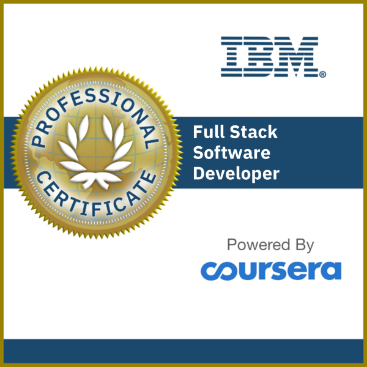
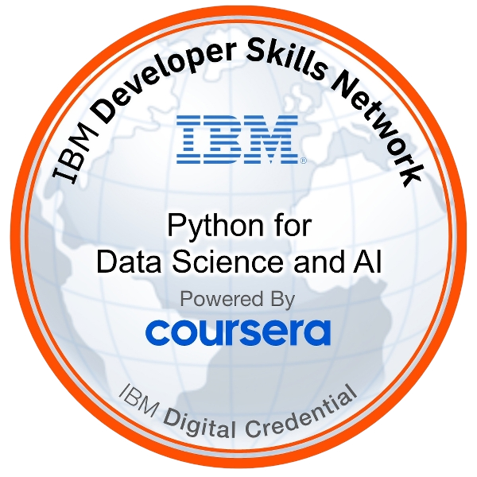
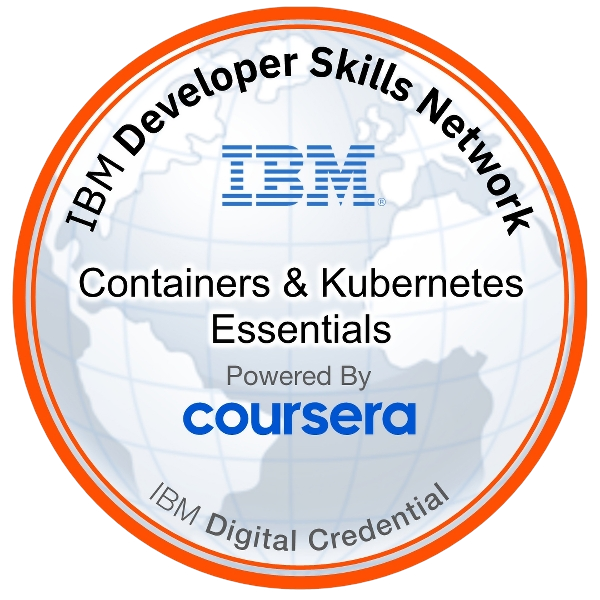
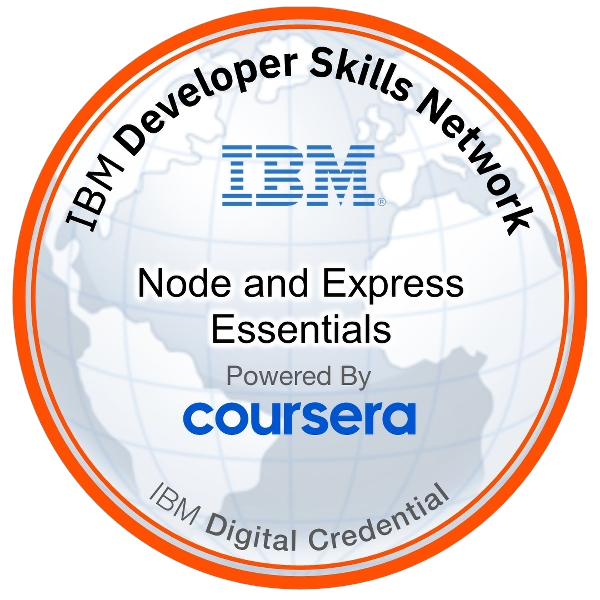
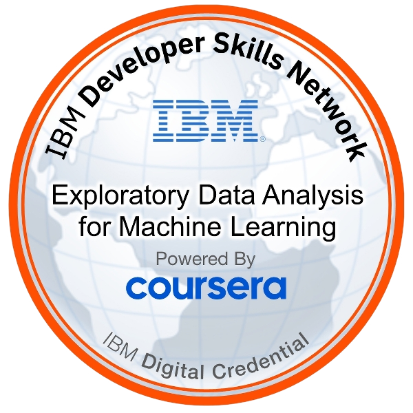
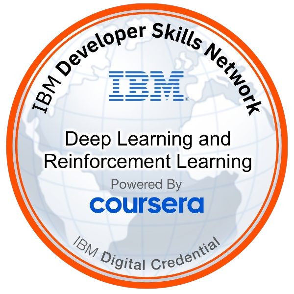
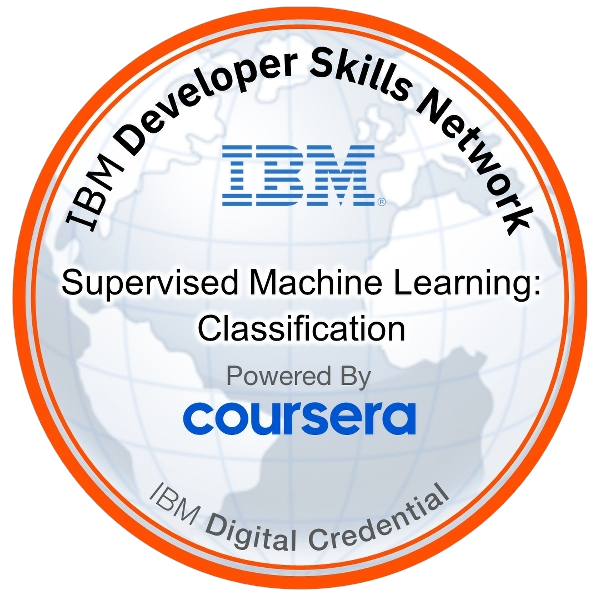
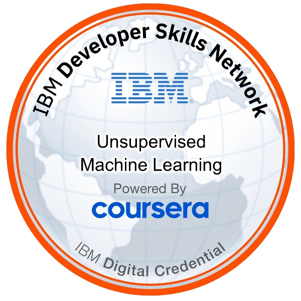

<h1 align="center">
  Hi there&nbsp;
  
</h1>

<h3 align="center">
  
</h3>

## Technologies I work with

<table>
<tr>

<td align="center" width="96">

 React
</td>

<td align="center" width="96">

 MongoDB
</td>

<td align="center" width="96">

 Node.js
</td>

<td align="center" width="96">

 Express
</td>

<td align="center" width="96">

 Tailwind
</td>

<td align="center" width="96">

 Flask
</td>

</tr>

<tr>

<td align="center" width="96">

 Python
</td>

<td align="center" width="96">

 Docker
</td>

<td align="center" width="96">

 Git
</td>

<td align="center" width="96">

 GitHub
</td>

<td align="center" width="96">

 SQL Server
</td>

<td align="center" width="96">

 M
</td>

</tr>
</table>

## Certifications

<!-- Full Stack Certifications -->
<h2 align="center">Full Stack Certifications</h2>

  <table style="width:100%; table-layout:fixed;">
    <colgroup>
      <col style="width:16.66%">
      <col style="width:16.66%">
      <col style="width:16.66%">
      <col style="width:16.66%">
      <col style="width:16.66%">
    </colgroup>
    <tr>
      <!-- Icon Row -->
      <td align="center">
        
      </td>
      <td align="center">
        
      </td>
      <td align="center">
        
      </td>
      <td align="center">
        
      </td>
      <td align="center">
        
      </td>
    </tr>
    <tr>
      <!-- Text Row -->
      <td align="center" valign="top">
        June 2025  
        <a href="https://www.credly.com/badges/39dc7ebd-4c71-4b7b-87a2-d2522dbd24fd/public_url">Credential</a> 
      </td>
      <td align="center" valign="top">
        June 2025  
        <a href="https://learn.microsoft.com/en-us/credentials/certifications/azure-fundamentals/?practice-assessment-type=certification">Credential</a> 
      </td>
      <td align="center" valign="top">
        June 2025  
        <a href="https://www.credly.com/badges/47d30a2e-4695-4a34-ae8e-46739c3bcd27/public_url">Credential</a> 
      </td>
      <td align="center" valign="top">
        June 2025  
        <a href="https://www.credly.com/badges/9bf9fc83-69c6-4d69-8230-49b0cf51a22b/public_url">Credential</a> 
      </td>
      <td align="center" valign="top">
        June 2025  
        <a href="https://catalog-education.oracle.com/ords/certview/sharebadge?id=9F23EA9CDABD0403F2F461CCAE25400C9A6CA4C8B5529CF1E5AB80E75BB3C0FC">Credential</a> 
      </td>
    </tr>
  </table>

<!-- ML Certifications -->
<h2 align="center">Machine Learning Certifications</h2>

  <table style="width:100%; table-layout:fixed;">
    <colgroup>
      <col style="width:16.66%">
      <col style="width:16.66%">
      <col style="width:16.66%">
      <col style="width:16.66%">
      <col style="width:16.66%">
    </colgroup>
    <tr>
      <!-- Icon Row -->
      <td align="center">
        
      </td>
      <td align="center">
        
      </td>
      <td align="center">
        
      </td>
      <td align="center">
        
      </td>
      <td align="center">
        
      </td>
    </tr>
    <tr>
      <!-- Text Row -->
      <td align="center" valign="top">
        Feb 2026  
        <a href="https://www.credly.com/badges/39dc7ebd-4c71-4b7b-87a2-d2522dbd24fd/public_url">Credential</a> 
      </td>
      <td align="center" valign="top">
        Feb 2026  
        <a href="https://learn.microsoft.com/en-us/credentials/certifications/azure-fundamentals/?practice-assessment-type=certification">Credential</a> 
      </td>
      <td align="center" valign="top">
        Feb 2026  
        <a href="https://www.credly.com/badges/47d30a2e-4695-4a34-ae8e-46739c3bcd27/public_url">Credential</a> 
      </td>
      <td align="center" valign="top">
        Feb 2026  
        <a href="https://www.credly.com/badges/9bf9fc83-69c6-4d69-8230-49b0cf51a22b/public_url">Credential</a> 
      </td>
      <td align="center" valign="top">
        Feb 2026  
        <a href="https://catalog-education.oracle.com/ords/certview/sharebadge?id=9F23EA9CDABD0403F2F461CCAE25400C9A6CA4C8B5529CF1E5AB80E75BB3C0FC">Credential</a> 
      </td>
    </tr>
  </table>

## GitHub Stats

  
  
  

## 🧠 LeetCode Performance

  

## 🤝 Connect With Me

  
  

 

  
<strong>👀 A secret message for curious devs...</strong>

   

  <pre align="center">
console.log("Let's build something meaningful");
  </pre>

